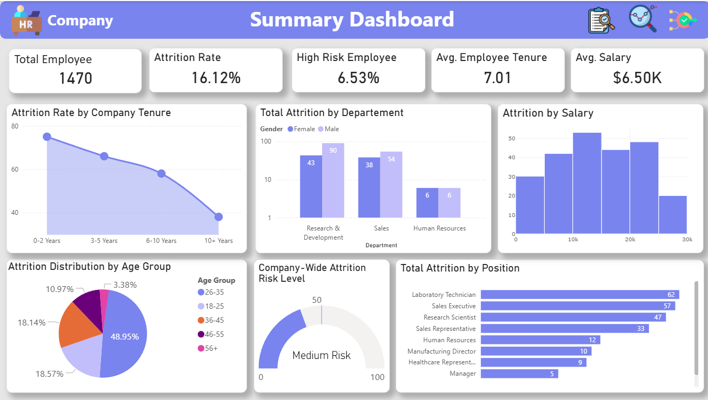

# 🧑‍💼 HR Attrition Analytics – Power BI Dashboard

Proyek ini berisi analisis mendalam mengenai Employee Attrition (karyawan keluar) pada sebuah perusahaan. Dashboard ini dikembangkan untuk memberikan pemahaman yang lebih baik kepada bagian HR terkait faktor penyebab attrition, area yang berisiko tinggi, serta rekomendasi solusi yang berbasis data.

---

## 📊 Dashboard Collection

### 1️⃣ Summary Dashboard
Insight utama:
- Total Employee
- Attrition Rate
- High Risk Employee %
- Avg. Tenure & Salary
- Attrition berdasarkan Tenure, Age Group, Salary Bracket, Department & Job Role Risk

📷 Screenshot  

---

### 2️⃣ Root Cause Analysis Dashboard
Fokus faktor penyebab attrition:
- Overtime vs Attrition Impact
- Salary Gap (Stay vs Attrition)
- Business Travel Pressure
- Irregular Working Hours
- Satisfaction Radar:
  - Job
  - Environment
  - Relationship
  - Work-Life Balance
  - Performance

📷 Screenshot  

---

### 3️⃣ Attrition Report Dashboard
Analisis mendalam posisi & departemen paling berisiko:
- Attrition Rate %
- High Risk Employee %
- Performance Score
- Lowest Satisfaction Position
- Salary Impact

📷 Screenshot  

---

## 🧠 Key Business Insights

| Temuan Utama | Dampak pada Bisnis | Arah Strategi |
|-------------|------------------|---------------|
| Attrition tertinggi di Sales & R&D | Pengaruh penjualan & inovasi | Program engagement khusus untuk kedua departemen |
| Overtime tinggi → Resign meningkat signifikan | Risiko burnout | Workload balancing & Overtime control |
| Salary keluar lebih rendah daripada yang bertahan | Perasaan undervalued | Salary band restructuring |
| Job Satisfaction & Environment Satisfaction rendah pada posisi teknis | Produktivitas & motivasi turun | Leadership, environment & career development improvement |
| Tenure < 3 tahun paling berisiko resign | Hilangnya talent lebih cepat | Retention program pada 3 tahun pertama |

---

## 🛠 Dataset

- WA_Fn-UseC_-HR-Employee-Attrition.csv  
(IBM HR Analytics Employee Attrition Dataset)

Fields relevan:
Attrition, Department, JobRole, MonthlyIncome, JobSatisfaction,
PerformanceRating, WorkLifeBalance, EnvironmentSatisfaction,
YearsAtCompany, Overtime, BusinessTravel

---

## 🧾 Tools & Technology

| Tools | Fungsi |
|------|--------|
| Power BI Desktop | ETL + Dashboard |
| Custom Visuals | Visualisasi analitik lanjutan |
| DAX Measures | Perhitungan KPI |

Custom visuals diambil dari:
> https://github.com/DataChant/PowerBI-Visuals-AppSource/tree/main/All%20Visuals

---

## 🎯 Business Goals

- Menurunkan attrition rate secara berkelanjutan
- Mengidentifikasi talent berisiko tinggi
- Memberikan HR decision support yang terukur
- Menyusun strategi employee retention jangka panjang

---

## 🔄 Project Roadmap

- [x] Summary Dashboard
- [x] Root Cause Analysis Dashboard
- [x] Attrition Report by Department & Job Role
- [ ] Action Plan Dashboard (HR Executable Strategy)
- [ ] Power BI Service Automation

---

## 👨‍💻 Author

**Syahrul Al Zayyan**  
Data Analyst | HR Analytics | Business Intelligence  

---

> ⭐ Jika Anda menyukai proyek ini, jangan lupa berikan star pada repository!
