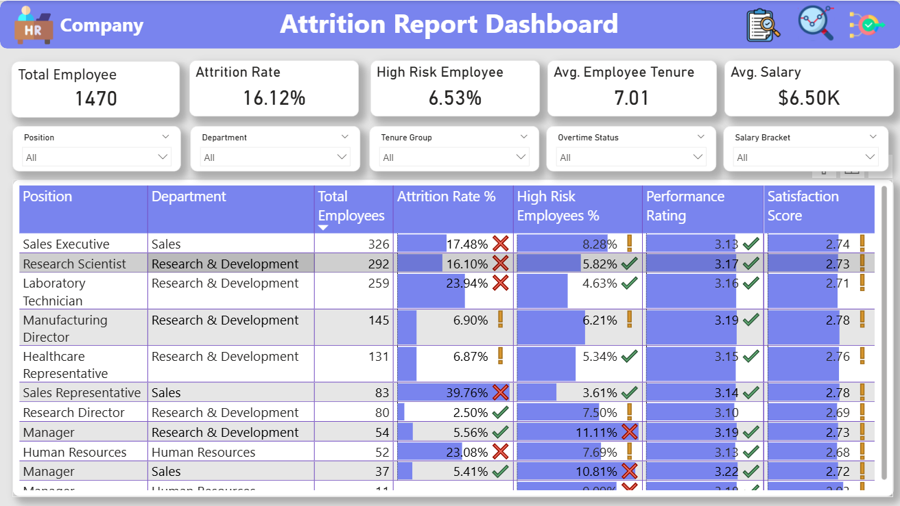
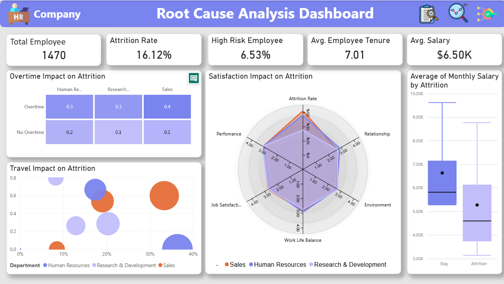

# HR Dashboard Project

A comprehensive HR analytics dashboard solution designed to provide insights into employee attrition, performance, and key human resources metrics. This project leverages Power BI to visualize critical HR data for better decision-making.

## 📊 Overview

The HR Dashboard project provides an interactive and visually appealing interface to analyze employee data, with a particular focus on understanding and predicting employee attrition. The dashboard enables HR professionals and management to make data-driven decisions based on key metrics and trends.

## 🚀 Features

- **Employee Attrition Analysis**: Deep dive into factors influencing employee turnover
- **Performance Metrics**: Track employee performance indicators
- **Demographic Insights**: Analyze workforce composition and diversity
- **Compensation Analysis**: Visualize salary structures and compensation trends
- **Engagement Metrics**: Monitor employee satisfaction and engagement levels
- **Interactive Visualizations**: Filter and drill-down capabilities for detailed analysis

## 📁 Project Structure

```
HR Dashboard/
├── Dashboard/
│   └── HR Analyst.pbix          # Power BI Dashboard File
├── Dataset/
│   └── WA_Fn-UseC_-HR-Employee-Attrition.csv    # Source Dataset
└── Images/
    ├── Attrition Report Dashboard.png
    ├── Root Cause Analysis Dashboard.png
    └── Summary Dashboard.png
```

## 📈 Dashboard Screenshots

### 1. Summary Dashboard

*High-level overview of key HR metrics and employee statistics*

### 2. Attrition Report Dashboard

*Detailed analysis of employee attrition patterns and contributing factors*

### 3. Root Cause Analysis Dashboard

*In-depth analysis to identify root causes of employee turnover*

## 📥 Dataset Information

The dashboard is built using the "WA_Fn-UseC_-HR-Employee-Attrition.csv" dataset which includes various employee attributes such as:
- Personal information (Age, Gender, Education, Marital Status)
- Employment details (Department, Job Role, Years of Service)
- Compensation data (Monthly Income, Percent Salary Hike)
- Performance metrics (Performance Rating, Work-Life Balance)
- Attrition indicators (Attrition status, Years at Company, etc.)

## 🛠️ Technologies Used

- **Power BI**: For creating interactive dashboards and visualizations
- **CSV Data Format**: For data storage and import
- **Power Query**: For data transformation and cleaning

## 📋 Requirements

- Power BI Desktop (latest version recommended)
- Microsoft Excel (for data validation, if needed)

## 🚀 Getting Started

1. **Download Power BI Desktop** from [Microsoft Power BI](https://powerbi.microsoft.com/desktop/)
2. **Clone or download** this repository to your local machine
3. **Open** the `HR Analyst.pbix` file in Power BI Desktop
4. **Update data source** if needed to point to your local copy of the dataset
5. **Refresh and explore** the dashboard

## 📊 Key Insights

This dashboard helps identify:
- Key factors contributing to employee attrition
- High-risk employee segments
- Department-wise performance trends
- Compensation gaps and equity issues
- Employee engagement patterns

## 🤝 Contributing

Contributions to enhance the dashboard are welcome! Feel free to fork this repository and submit pull requests for:
- New visualization ideas
- Improved data models
- Additional KPIs and metrics
- Bug fixes and performance improvements

## 📞 Contact

For questions or suggestions regarding this HR Dashboard project, please feel free to contact me through GitHub.

---

**Note**: The dashboard is built using a sample HR dataset and can be customized for specific organizational needs by replacing the data source with your actual HR data.